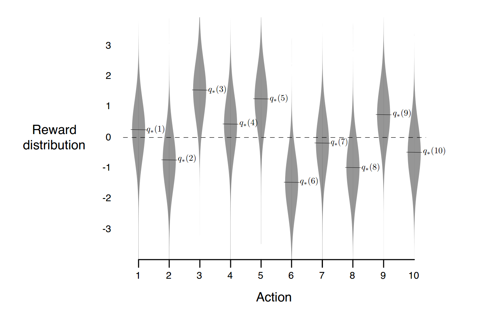

### [C1_W1] What is Reinforcement Learning (RL)?

[comment]: <> (<span style="font-size:1.3em;">)

“Reinforcement learning focuses on goal-directed learning of an agent from interaction” with its environment.

RL task is for an agent to learn how to optimally interact with a given environment using available sensors / information about environment

The general goal can be divided into 2 'categories':
 - how good it is to be in a given state (value function)
 - how good it is to take a one of actions given a state it is in (action-value function)

given a state agent is in contains complete information to make such decision (has a Markov's property)

 
In other words it is a methodology for an agent to learn
_“how to map situations to actions — so as to maximize numerical reward signal”_

Like the term machine learning, term reinforcement learning can be used to refer

 - a problem
 - a class of solution methods that work well on the problem 
 - field that studies this problem and its solution methods
 
### [C1_W1] How is RL different from supervised and unsupervised learning?

In supervised learning (SL), from a training set of labeled examples, a general understanding of mapping of different situations and correct action or response or categorization is developed. This mapping is then projected to provide a label or action to a new data situation (that was not in training set). By itself, SL does not learn from interaction. Another way of seeing the difference in RL and SL is that in RL the impacts of action taken in a situation is evaluated, while in SL the correct action that should be taken in a situation is instructed.

The other machine learning category — unsupervised learning (UL) — is focused on identifying classes or structures underlying in an unlabeled data set while the objective of RL is to maximize reward signal. In simple words, unlike supervised learning, reinforcement learning does not learn from labeled examples and unlike unsupervised learning the objective of reinforcement learning is not to identify underlying structure in a data set. Hence, it is stated in the book that…

_“We therefore consider reinforcement learning to be a third machine learning paradigm, alongside supervised learning and unsupervised learning and perhaps other paradigms.”_


## [C1_W1] (Multi) K-armed Bandit Problem


“If you maintain estimate of the action values, then at any time step there is at least one action whose estimated value is greatest. We call these the greedy actions. when you select one of these actions, we say that you are exploiting our current knowledge of the values of the actions. If instead you select one of the nongreedy actions, then you are exploring, because this enables you to imrpove your estimate of the nongreedy action’s value.”

from ‘ Reinforcement Learning: An Introduction second edition Richard S. Sutton and Andrew G. Barto The MIT Press Cambridge, Massachusetts London, England’

In other words there might be a better action which was not selected yet and it's estimated value is lower than current best action


An example bandit problem with the 10-armed testbed. The true value q<sub>\*</sub>(a) of each of the ten actions was selected according to a normal distribution with 
mean zero and unitvariance, and then the actual rewards were selected according to a mean q<sub>*</sub>(a), unit-variancenormal distribution, as suggested by these gray distributions.





If there are K options of action to take, select an action according to a mean q*(a) unit variance normal distribution when selecting a certain action.

First of all, we have to estimate action values


### [C1_W1] What is a k-armed Bandit Problem?

A simple case of a k-armed bandit problem is considered here. It is simple because it involves learning to act in only one situation (nonassociative setting). For a repeated number of times, the agent faces to choose among k different actions. A numerical reward is assigned depending on the choice of action. The numerical award is chosen from a stationary probability distribution that depends on the chosen action. In this problem, each of the k actions, has an expected or mean reward given that action is selected. This reward is also called the value of the action.


_Key Notations_:

- t is time step,

 - A<sub>t</sub> is action at time step t,

 - R<sub>t</sub>  is the corresponding reward to the action at time step t,

 - q<sub>t</sub> (a) is the value of action a or expected reward given action a is selected,
 
where,

q<sub>t</sub>(a) = E[R<sub>t</sub> | A<sub>t</sub>=a]

### [C1_W1] What exactly is the problem ?

The problem is that you don’t know the value of all actions (a). If you did, you could easily choose the one with highest value. However, you might have a way to find estimates of these values. Estimated value of an action a at time t is denoted as Q<sub>t</sub>(a). We want to have an accurate estimate that is we want Q<sub>t</sub>(a) to be as close to q<sub>*</sub>(a) as possible.


### [C1_W1] Choose an action — what is exploration and exploitation in RL?

The action with highest estimate at a time step t, is called greedy action(s). If you choose greedy action at a time step, it is termed as “exploiting” your current action value knowledge (estimates). Alternately, if you choose any other non-greedy action, it is termed as “exploring”. Exploring allows you to gain more knowledge of non-greedy actions thus improving their estimates. Note that while exploitation allows to maximize reward at a time step t, exploration can help you maximize reward in long term by improving your estimates. So, should we only explore or only exploit or consider both? Something we will learn more about in the course later.


### [C1_W1] Action-value Methods

Ok, but how is this implemented? That is, how do we estimate action-values? And, how do we use these estimates to choose an action at time t?


_How do we estimate action-values?_


One simple way is the sample average method for estimating action values. In this method the estimate of an action values is the average of rewards actually received prior to t (learning from previous interactions) for the action. That is,


Q<sub>t</sub> = (sum of rewards when a taken prior to t) / (number of times a taken prior to t)


If number of times a taken prior is 0 then we can assume a default value for Q<sub>t</sub>: 

Q<sub>t</sub> = 0


_How are the action-value estimates used to choose an action at time t?_


### [C1_W1] Greedy action selection method


Greedy action selection rule is to select one of the actions with the highest estimated value.


A<sub>t</sub> = argmax<sub>a</sub>Q<sub>t</sub>(a)


### [C1_W1] Near-greedy selection method


An alternative method is to choose greedy action most times, except at times with small probability epsilon, select an action randomly with equal probability from all actions. Such near-greedy action rules are also called epsilon-greedy methods. Over infinite steps (many action choices), all actions are selected multiple times and so all Q<sub>t</sub>(a) converge to q<sub>*</sub>(a). This also implies that in near-greedy selection method, because of equal probability of random action selection at times, the probability of selecting the optimal action converges to greater than 1 - epsilon.


### [C1_W1] Incremental Implementation


Now, we know how action values are estimated and how the estimates are used to choose an action at any time t (greedy and non-greedy selection). Next, let’s see how action-value methods can be implemented efficiently computationally. As mentioned previously, one of the action value estimates is sample average of observed rewards. Let R<sub>i</sub> denotes reward received after this particular action is selected for i number of times and Q<sub>n</sub> denote estimate of the action value after it has been selected n-1 times. Thus, action value estimate using simple average method is


However, to keep a record of all previous reward values (R<sub>1</sub>, R<sub>2</sub>..)is computationally costly. Hence, instead incremental formulas that allow to update averages with little computation to obtain new reward estimates, are used. Following incremental formula is used is coded to computationally implement the simple average method.


That is, new_estimate ← old_estimate + step_size[target - old_estimate]

The value of step_size parameter changes with time step, since it depends on n. Step_size parameter is also denoted as alpha or alpha<sub>t</sub>(a).


### [C1_W1] Action-Value Estimation for Nonstationary Problem


The simple averaging method mentioned till now considers stationary problem, where reward probabilities don’t change with time. However, most real-world applicable RL has to deal with nonstationary problems. One of the ways to perform action-value estimates for nonstationary problem is to consider weighted average with higher weights to recent rewards and lower weights to long-past rewards, instead of simple average. This is done by modifying the step_size parameter alpha from 1/n to a constant value that belongs to {0,1]. This change modifies the new_estimate equation above to an exponentially recency-weighted average.


```python
n = 10000
qnm = 100
qm = 100
rn = -200

for r in range(100):
    qn_1_nm = qnm + 1 / n * (rn - qnm)
    qn_1_m = qm + 0.1 * (rn - qm)
    print('Step: {} | Q_n+1 1 / n: {} | Q_n+1 const. alpha: {} | '.format(n + 1, qn_1_nm, qn_1_m))
    qnm = qn_1_nm
    qm = qn_1_m
    n += 1
```

### [C1_W1] Optimistic Initial Values


The estimation methods considered till now, are dependent on Q<sub>1</sub>(a) that is the initial action-value estimates. This also implies that the estimation methods are biased to initial value estimates. Thus, initial value estimate becomes another parameter to pick. Setting optimistic initial values that are not matched any rewards, can increase exploration, even in greedy-action selection method. This is the upside on using optimistic initial value to encourage exploration. However, this method is unlikely to work for nonstationary problem where the initial value of actions are not of much interest.


by setting initial value as 2 for each actions , agent can try all three options.


So how we can represent the uncertainty of the action and how it encourage to pick an action which has the highest uncertainty.


### [C1_W1] Upper-Confidence-Bound (UCB) Action Selection


Another method of action selection in the UCB, where exploration is encouraged by using epsilon-greedy selection method with a modification. In epsilon-greedy method, an action among all equally likely actions are selected randomly. In UCB, the potential for actions to be optimal is considered while selection instead of a random selection. The action selection is based on maximization of following expression. The square root term here is representative of uncertainty, where numerator is natural log of time step t and denominator N<sub>t</sub>(a) number of times action a has been selected prior to time t. Higher number of times an action has been selected in the past it has lower uncertainty. With increase in time t, due to natural log, the rate of increase of numerator value decreases. Thus, this method encourages exploration however actions that have been selected multiple times in past are less likely to get selected due to lower estimate value.


UCB method performs better than e-greedy method because it explores more by reducing uncertainty rather than just pick randomly for 10 percent of time.
The more iterations the harder it will be for UCB to make you change action (assuming true values are significantly different, i.e. 10 and 100).


In summary, how it updates.


These topics cover week 1 material. Next week’s material focuses on finite Markov Decision Processes.

[comment]: <> (</span>)