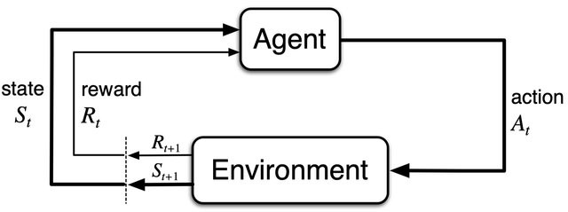
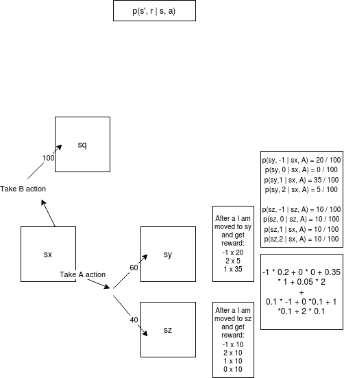
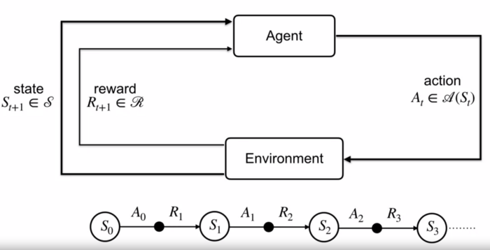
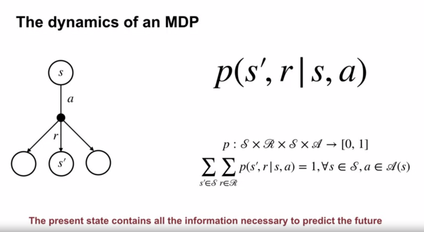
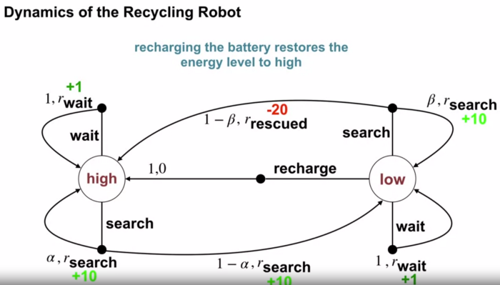
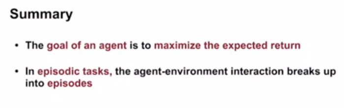
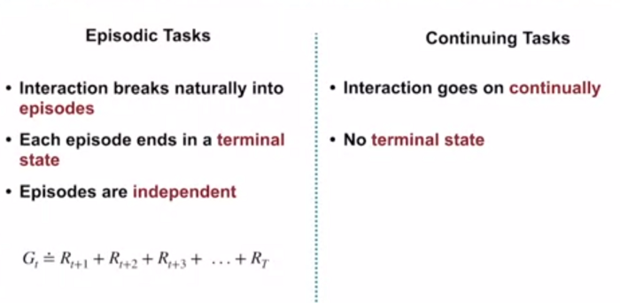
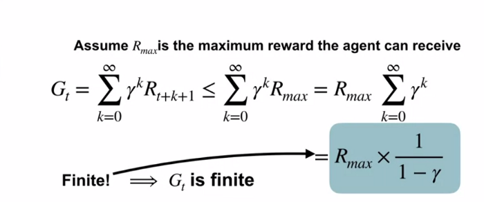
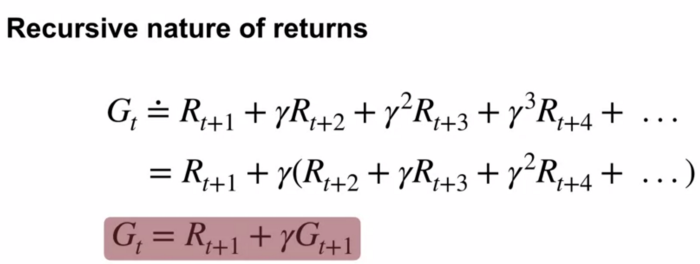
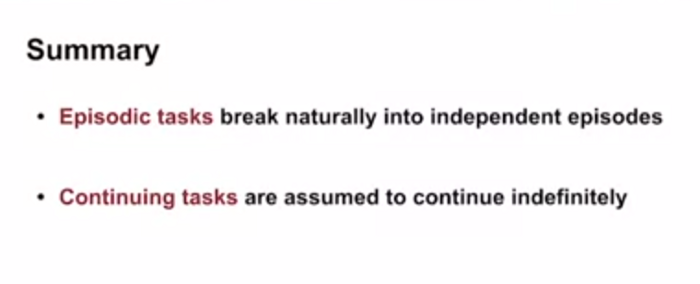

## Fundamentals of Reinforcement Learning (Coursera course notes -Week 2)
Coursera course — Fundamentals of Reinforcement Learning — Week 2 notes
Abhilasha Saroj
Abhilasha Saroj
Sep 9·5 min read

8 September 2020

[comment]: <> ()

This article documents notes for Coursera course — [Fundamentals of Reinforcement Learning](https://www.coursera.org/learn/fundamentals-of-reinforcement-learning/home/welcome). The article summarizes week 2 material of the course. This is second of four such articles covering the 4 week course material. Notes documented in this article are based on reading from section 3.0 to 3.3 of book [“Reinforcement Learning: An Introduction” by Andrew Barto and Richard S. Sutton](https://mitpress.mit.edu/books/reinforcement-learning-second-edition) and Coursera video lectures for week 2.

Personally, I think the course and book reading are fundamental to developing an understanding of the topic. However, in case the knowledge gets rusty with time, this article aims to provide a summary (or go-to resource) to review the fundamentals quickly. So, let’s begin.

### What are Finite Markov Decision Processes (MDPs) ?

Finite MDPs are type of problems that require evaluative feedback just like k-armed bandit problem discussed in week 1. However, unlike k-armed bandits problems, finite MDPs also involve associative aspect, that is, in this problem the agent is faced with choosing different action in different situations.

MDPs are formalization of sequential decision making problems, where the current actions influence subsequent future rewards. Hence, in MDPs a trade off between immediate and delayed reward is evaluated.

### Agent-Environment Interface in a MDP

Learner or decision-maker is agent. Everything else outside the agent is environment. Agent and environment interact continuously. The agent chooses an action, to which the environment responds by giving reward for the chosen action and setting new state of the system as a consequence of the taken action. Based on the state of environment, next choice of action is made by the agent. As mentioned previously the agent tries to maximize all incoming rewards.

Image from the book by Andrew Barto and Richard Sutton.

In the figure, the subscript t corresponds to time step t. The time steps in MDP problem can be fixed time intervals or successive stages of decision making and action choices. The agent and environment interact at sequence of discrete time steps. The agent receives information about situation of the environment as state (St) among set of possible states S and chooses an action (At) among set of possible actions in the state, A(s). In the next time step, in response to last action, the environment gives a reward Rt+1 that belongs to set of all possible rewards R and provides information about new state of environment St+1 to the agent. So, the sequence goes like below.

    

### What is finite about finite MDPs ?

_“In a finite MDP, the sets of states, actions, and rewards (S, A, and R) all have a finite number of elements.”_

In finite MDPs, the random variables Rt and St (reward and state at time step t) have a defined probability distribution dependent on last state and action. There is probability of next state value to be s’ and reward value to be r at time step t, given last state (at t-1) was s and last action (at t-1) was a. This probability function p defines the dynamics of the finite MDP, hence is referred as the four-argument dynamic function.

    

Since p provides the probability distribution for each choice of last action a and last state s. Thus, summed over all possibilities the value is 1.

    

### Markov Property

Note that in the dynamic function, the probability of possible value for St and Rt depends only on the last state and action, St - 1 and At - 1. Thus, “the state must include information about all aspects of the past agent–environment interaction that make a difference for the future.” Such a state is said to have Markov property. This is an underlying requirement to formalize a finite MDP problems.

Four-argument dynamic function p can be used to determine three-argument state-transition probabilities, and expected rewards.

    

Expected reward for state-action pairs (two-argument function)

    

Expected reward for state-action-next state triplets (three argument function)

    

### Goals and Rewards

In RL, the goal of an agent is to maximize the total reward signal obtained from the environment from agent-environment interactions, that includes, immediate and future rewards.

    Reward Hypothesis

    “That all of what we mean by goals and purposes can be well thought of as the maximization 
     of the expected value of the cumulative sum of a received scalar signal (called reward).”

This idea of using reward signal to define agent’s learning goal is unique to RL. Thus, the choice of rewards and goals are crucial to define exactly what we want to achieve from the RL problem.

### But, how does an agent maximize the cumulative rewards?

The agent seeks to maximize the sum of sequence of rewards received after time step t, G_t or expected return defined as below, with T as final time step when the process terminates, also known as terminal state.

Gt = Rt+1 + Rt+2 + Rt+3 + Rt+4 + ... + RT

[comment]: <> (
)

[comment]: <> (    )

[comment]: <> (
)

_Episodic Tasks_

For MDP problems, where there is a clear end to sequence of tasks, where after terminal state the state is reset to same starting set, are termed as episodic tasks such as a chess game, going through maze etc. S+ denotes set of all terminal and non terminal states and S denotes set of all non terminal states. T is a random variable that takes value of time of terminal state that can vary between episodes.

_Continuing Tasks_

MDP problems, where there is no clear or well-defined end of sequential tasks, and thus, the agent-environment interaction cannot be broken into episodes, are called as continuing tasks. Continuing tasks can go on continually without any limit. This limitless task process makes it difficult to formulate the computation of cumulative rewards, since here T is infinity and the value of cumulative rewards (or expected return) can also be infinite. Hence, to mathematically approach the problem of continuing tasks, instead of maximizing expected return, a modified version — expected discounted return is maximized. Expected discounted return is defined as follows, where $\gamma is the discounting rate parameter, that lies in [0,1].

[comment]: <> (
)

[comment]: <> (    )

[comment]: <> (
)

    

[comment]: <> (
)

[comment]: <> (     )

[comment]: <> (
)

The discount rate \gamma here regulates the expected return of a current action in future time steps. The impact on long-future reward from a present action gets lower. For a 0 value of \gamma the expected return only depends on immediate reward (agent is “myopic”, it only wants to maximize R_{t+1}). With the value of \gamma getting closer to 1, the agent gets more far-sighted that its return significantly depend on long-term rewards from immediate action. Incremental relation to compute expected discounted return is below.

    

Important thing to note is that by using discounted rewards, the value of expected discounted return is finite if rewards is non-zero and constant for \gamma <1 . For a constant reward of +1, the expected discounted return is sum of geometric progression.

    

## [Personal Notes] Fundamentals of Reinforcement Learning — Week 2
Seungkyu Lee
Seungkyu Lee
Nov 22, 2019·2 min read

As the environment is changing with a probability, so it’s dynamic.

In a Markov decision process, the probabilities given by p completely characterize the environment’s dynamics. value for state and reward depends only on the immediately preceding state and action.

The general rule we follow is that anything cannot be changed arbitrarily by the agent is considered to be a part of environment.

The reward signal is your way of communicating to the robot what you want it to achieve, not how you want it achieved.

one of examples of continuing tasks is controlling temperature because the temperature keep going.

by using discount, the continuing task expected return is finite

an example of Episodic tasks is games

an example of Episodic tasks is managing server by scheduling with considering priority.

[comment]: <> ()