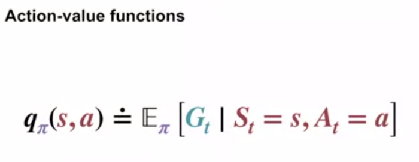

### [C1_W3] What are policies and value functions ?

RL considers evaluative feedback to train an agent. Most RL algorithms involve estimation of value functions, described in the book as:

 - _“ functions of states (or of state-action pars) that estimate how good it is for the agent to be in a given state (or how good it is to perform a given action in a given state)”_

“how good” — refers to expected return (cumulative future rewards).

Future rewards or expected return depends on the set of actions to be chosen by the agent or ways of acting, referred as policies. As stated in the book:

 - _“Formally, a policy is a mapping from states to probabilities of selecting each possible action.”_

Policy is represented by mathematical symbol pi and pi(a|s) 
is the probability that At = a if St = s. RL methods inform the change in agent’s policy as it gains more experience.

### [C1_W3] State-value function for policy pi (vpi)

The value function for state s with policy pi (vpi(s)) is the expected return starting with state s that are followed by actions defined under policy pi.

### [C1_W3] Action-value function for policy pi (qpi)

The value of taking an action a in state s under policy pi (qpi(s,a)) is the expected return starting at state s and action a, and then following policy pi.

### [C1_W3] How do we estimate the value functions?

To estimate state-value function under policy pi for state s, vpi(s), from experience can involve an agent to find the average of all rewards experienced by the agent followed by state s. If the state s is encountered infinite number of times, then the average will converge to state’s value vpi(s).

_“We call estimation methods of this kind Monte Carlo methods because they involve averaging over many random samples of actual returns.”_

### [C1_W3] Recursive relationships of value functions

For computational implementation of RL dynamic programming is crucial, which is executed by establishing recursive relationships for estimations. The recursive relation established earlier in estimation of expected return is used to obtain recursive relation of state-value function for policy pi.

This is bellman equation for state value function under policy pi that establishes relation between value of a state and value of the next states.

For proof please refer to 

### [C1_W3] Bellman equation for vpi

The Bellman equation averages over all the possibilities, weighting each by its probability of occurring.

The value of the start state must equal the (discounted) value of the expected next state, plus the reward expected along the way.

_“It states that the value of the start state must equal the (discounted) value of the expected next state, plus the reward expected along the way”._

### [C1_W3] Optimality (Optimal Policies & Optimal Value Functions)

To solve a RL problem, we aim to find the optimal policy — policy that provides maximum expected return in long run. A policy pi is considered better than or equal to policy pi’ if the expected return for policy pi is greater than or equal to that for policy pi’ for all states. Optimal policy is the policy that is better than or equal to any of the other policies for all states (denoted as pi*). The optimal state-value function v*(s) is

There is always at least one policy that is better than or equal to all other policies.

If there are more than one optimal policies, they share the same optimal state-value function and the same optimal action-value function (q_{*}(s,a)), defined below.

Note that q* can be expressed in terms of v*, since q* represents the expected return after taking action a at the starting state s and following optimal policy.

v* follows the Bellman equation for state values defined above.

### [C1_W3] Bellman optimality equation for v_{*}

Under an optimal policy, the value of a state, must be the expected return for the optimal action at that state.

Bellman optimality equation for q*

Bellman Optimality equation relies one at least three assumptions that are rarely true in practice.

 - Accurately know the dynamics of the environment.
 - Have enough computational resources
 - Markov Property.

### [C1_W3] Specifying policies

sum of all the probabilities has to be 1

In games like chess and the above, there is spare rewards because reward is only given when somebody wins and when the agent moves to A or B.

In this kind of cases, value function is pretty crucial.

 - the reason why value function of state A is lower than 10 is because after A moves to A’, there are more possibilities to bump and get negative reward.
 - and the state of B has larger value than the reward because after it moves to B’, there is no such next state to get negative rewards.

### [C1_W3] How do Bellman optimality equations help solve the RL problem?

For n states, there are n bellman optimality equations, one for each state, and n unknows (optimal value for each state — v_{*}). When the dynamic p of a MDP is given, the values of v_{*} for each state can be found by solving the system of linear equations. Once we have v_{*}, then the policy that gives nonzero probability to the actions with maximum value at all states can be identified as the optimal policy.

_“If you have the optimal value function, v_{*}, then the actions that appear best after a one-step search will be optimal actions.”_

_“any policy that is greedy with respect to the optimal evaluation function v_{*} is an optimal policy”_

The most important and elegant aspect of Bellman optimality equations is that with v_{*} “the optimal expected long-term return” is “locally and immediately available for each state”.

### [C1_W3] Summary

#### [C1_W3] State-value Bellman Equation

One of the points is that it multiplies with the probability of next state

for the expected return, it sums all the action

#### [C1-W3] Action-value Bellman equation

at this time, for the expected return, it has to compute each actions and multiply with the probability and sum it all.

#### [C1_W3] State-value Bellman equation - example

#### [C1_W3] Optimal policy with discount gamma

The optimal policy has to have the highest value at all the states

Bellman Optimality Equation is always picking the highest value’s action at each state like the graph above.

we don’t know what’s the optimal policy yet so we can’t follow optimal policy with Linear system solver.

we have to find the optimal policy by doing max a.

So the maximum value will be 10 and the optimal action will be A2.

The difference between the state value function and action value function is that the state value function has to be computed with the one-step dynamics of the MDP.

However, much less work is required if we have the optimal action value function.

for the state action value function, it’s easier to say that even though the agent take a certain same action, the state might be changed differently. Therefore, it multiplies the probability of state transition.

