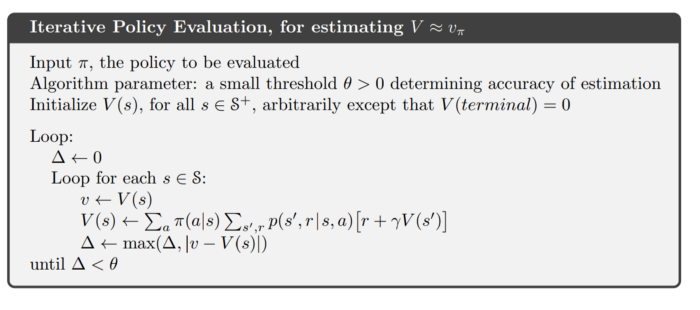

### [C1_W4] What is Dynamic Programming (DP) ?

Dynamic programming (DP) is set of algorithms used to compute optimal policies in a perfect Markov Decision Process (MDP) model of an environment. A classical DP is however of less use in practice to solve RL problems, because most RL problems aren’t perfect MDPs. However, most methods used in practice to compute optimal policies try to achieve effects similar to that of a DP. Hence, it’s crucial to develop an understanding of classical DP for optimal policy evaluation. Here, the environment is a finite MDP — the set of states (S), rewards (R), and actions (A) are finite and dynamic function of the MDP is p(s’,r|s,a) for all s in S and a in A. It is stated in the book, that

    “The key idea of DP, and of reinforcement learning generally, is the use of value functions to organize and structure the search for good policies.”

by using the state or state action value function, it figures out good policies (obtains optimal policies) which satisfies the Bellman optimality equations.

However, there are three requirements to satisfy the Bellman optimality equations.

    accurately know the dynamics of the environment.
    have enough computational resources
    Markov property.

### [C1_W4] Optimal policy recap

There are two steps to finding optimal policy:

    To find optimal value functions
    Evaluate optimal policy from the optimal value functions

The bellman optimality equations for the optimal value functions, v_{*} and q_{*} are:

### [C1_W4] Policy Evaluation (prediction)

it’s quite difficult to understand this part.

Could anybody help me understand this part ?

### [C1_W4] Computing value functions under a policy using DP

In DP, policy evaluation is also known as prediction problem. State value function under policy pi can be expressed (Bellman equation) as follows:

Note that

    “The existence and uniqueness of v_{\pi} are guaranteed as long as either \gamma < 1 or eventual termination is guaranteed from all states under the policy \pi.”

The above equation gives a system of linear equations that has total number of equations and total number of unknowns equal to the total number of states. The unknowns are value functions for each state under policy pi (v_{\pi}(s), s \in S). With large number of states, the system of linear equations can be very large, making it computationally expensive to solve. For this reason, iterative policy evaluation algorithm is used. The values for each state are initialized with a random number, and the value of v_{pi)(s) is updated after each iteration until it almost converges. Following is the iterative representation of the bellman equation for state value function under policy mentioned above, where k is the iteration count.

    “it replaces the old value of s with a new value obtained from the old values of the successor states of s, and the expected immediate rewards, along all the one-step transitions possible under the policy being evaluated”

This iterative update operation is called expected update. Thus, iterative policy evaluation method is used to compute the value function for all states under policy pi. Towards finding an optimal policy, the next step is to improve the existing policy — Policy improvement.

### [C1_W4] What is policy improvement ?

At a state s, if the value for taking another action (other than that executed in the current policy) with all subsequent actions as per policy pi is greater than the original state value function for pi, then this new policy is better than the original policy pi. The new policy is referred to as pi’ here. This is followed from policy improvement theorem which expresses that the policy pi’ is better than or equal to policy pi if for all states the value under policy pi’ is greater or equal to that under policy pi.

Policy improvement theorem

Thus, if above inequality holds then the new policy pi’ is indeed better than original policy pi. This method of considering change in policy by choosing a different action at a state can be extended to all state and all possible actions by choosing action q_{pi}(s,a) greedily at each state.

    “The process of making a new policy that improves on an original policy, by making it greedy with respect to the value function of the original policy, is called policy improvement”

If the new greedy policy pi’ is equal to existing policy pi, then policy pi’ and pi are equally good and both are optimal policy, that is v_{\pi’} = v_{*}.

It is the proof of the policy improvement theorem.

after the pie is updated like selecting action a arbitrary to get maximized reward in a certain State, the updated pie pick the a whenever it’s encountered the State.

It keeps picking a action in a greedy way every state.

and the policy improvement must give us a better policy except when the original policy is already optimal.

In the stochastic case, each maximizing action van be given a portion of the probability of being selected in the new greedy policy.

### [C1_W4] Policy Iteration

Policy iteration is an algorithm implemented to find optimal policy by recursively performing two steps:

    policy evaluation (compute v_{\pi})
    policy improvement, find a better policy pi’

    Once a policy, pi, has been improved using v_{\pi} to yield a better policy, pi’, we can then compute v_{\pi’} and improve it again to yield an even better policy, pi’’ .

Since policy iteration requires the iterative policy evaluation to compute values in every step, another algorithm “value iteration” is considered to find optimal policy.

this part is also quite hard to explain.

Can anybody help me explain ?

Jack’s car rental

### [C1_W4] Value Iteration

Instead of waiting for complete convergence of v_{\pi} in policy evaluation step, only one iteration step is performed for policy evaluation at all states. This method that truncates the policy evaluation and combines this truncated policy evaluation with greedy policy improvement, represented as follows.

    “Note that value iteration is obtained simply by turning the Bellman optimality equation into an update rule. Also note how the value iteration update is identical to the policy evaluation update except that it requires the maximum to be taken over all actions.”

### [C1_W4] Generalized Policy Iteration

Generalized policy iteration (GPI) is general term given to the interaction between policy evaluation and policy improvement that eventually converge to find optimal value functions and optimal policy. In policy iteration method policy evaluation and policy improvement both processes interact and update without waiting to completely converge.

Image captured from the reference book by A. Barto and R. Sutton

Note that in GPI, the two processes — policy evaluation and policy improvement — are of opposing nature to each other but converge eventually towards the same goal of finding optimal policy and optimal value functions. The opposing nature is because policy improvement (greedy policy update) makes the current value function incorrect for the updated policy, then in policy evaluation the value functions for the new policy are evaluated that can pull the new policy away from greedy.

    “The evaluation and improvement processes in GPI can be viewed as both competing and cooperating.”

Image captured from the reference book by A. Barto and R. Sutton

With this (last of four article series), the fundamental concepts of reinforcement learning, guided in the course, are covered.

### [C1_W4] Policy evaluation and control

Policy evaluation is the task of determining the state-value function V pie, for a particular policy pie.

Control is the task of improving an existing policy.

Dynamic programming techniques can be used to solve both these tasks, if we have access to the dynamics function P.

by doing the iterative policy evaluation, it keeps refining estimation and improving.

The new policy is a strict improvement over pie unless pie is already optimal.

how policy improvement theorem works is that with a given policy, it’s acting greedily

Value iteration allows us to combine policy evaluation and improvement into a single update.

Asynchronous dynamic programming methods give us the freedom to update states in any order.
Image for post

